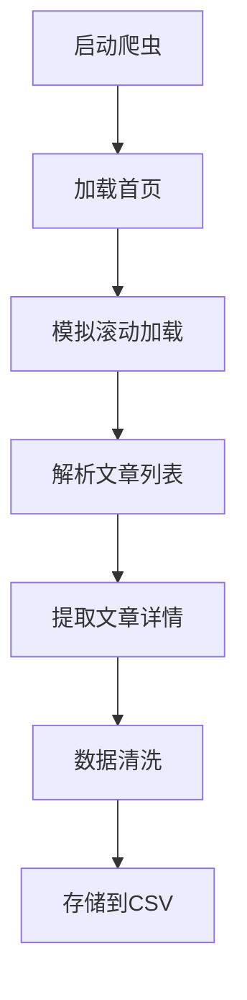

# GitHub 项目文档：新闻爬虫系统

## 📌 项目概述
这是一个基于 Scrapy 框架的多源新闻爬虫系统，能够从网易新闻、腾讯新闻和澎湃新闻等主流新闻网站抓取新闻数据。系统采用浏览器自动化技术处理动态加载内容，并将爬取结果存储为结构化 CSV 文件。

## 🛠️ 技术栈
- **爬虫框架**: Scrapy
- **浏览器自动化**: DrissionPage (ChromiumPage)
- **数据存储**: CSV
- **HTML 解析**: CSS 选择器

## 📂 文件结构
```
/news_crawl
│── news_crawl/
│   ├── spiders/
│   │   ├── netease_spider.py    # 网易新闻爬虫
│   │   ├── pengpai_spider.py    # 澎湃新闻爬虫
│   │   └── tencent_spider.py    # 腾讯新闻爬虫
│   ├── items.py                 # 数据模型定义
│   ├── middlewares.py           # 中间件
│   ├── pipelines.py             # 数据处理管道
│   ├── settings.py              # 爬虫配置
│   └── __init__.py
│── README.md                    # 项目说明文档
└── requirements.txt             # 依赖库列表
```

## 🔧 安装与运行

### 1. 环境配置
pychram

### 2. 运行爬虫
```bash
# 运行所有爬虫
scrapy crawl netease   # 网易新闻
scrapy crawl thepaper  # 澎湃新闻
scrapy crawl tencent   # 腾讯新闻

# 或者运行指定数量的爬虫
scrapy crawl netease -a max_articles=100
```

## 🧠 系统架构

### 爬虫工作流程


### 核心功能
1. **动态内容处理**：使用 DrissionPage 渲染页面并模拟滚动加载
2. **数据去重**：基于 URL 的去重机制
3. **数据验证**：确保关键字段不为空
4. **限流控制**：可配置最大爬取数量

## 💡 核心组件说明

### 爬虫类
| 爬虫 | 目标网站 | 特点 |
|------|---------|------|
| `NeteaseSpider` | 网易新闻 | 处理相对时间格式 |
| `ThePaperSpider` | 澎湃新闻 | 支持时间排序 |
| `TencentSpider` | 腾讯新闻 | 简洁的内容提取 |

### 数据模型 (`NewsCrawlItem`)
```python
class NewsCrawlItem(scrapy.Item):
    title = scrapy.Field()             # 文章标题
    content = scrapy.Field()           # 文章内容
    publish_time = scrapy.Field()      # 发布时间
    url = scrapy.Field()               # 文章链接
    publish_time_relative = scrapy.Field()  # 相对发布时间
```

### 数据处理管道 (`CsvWriterPipeline`)
- URL 去重
- 数据验证
- CSV 写入
- 实时刷新文件

## ⚙️ 配置选项
在 `settings.py` 中可配置：
- `USER_AGENT`: 用户代理
- `ROBOTSTXT_OBEY`: 是否遵守 robots.txt
- `DOWNLOAD_DELAY`: 下载延迟
- `CONCURRENT_REQUESTS`: 并发请求数
- `ITEM_PIPELINES`: 数据处理管道

## 📊 数据输出
爬取的数据将保存为 `merged_news_data.csv`，包含以下字段：
- url
- title
- content
- publish_time

## 🚀 扩展建议
1. 添加更多新闻源
2. 实现数据库存储
3. 增加定时爬取功能
4. 添加反爬虫策略
5. 实现分布式爬取

## 📜 开源协议
MIT License

---

> 提示：运行前请确保已安装 Chrome 浏览器。系统会自动跳过无效数据并记录日志。可根据需要调整各爬虫的 `max_articles` 参数控制爬取数量。
